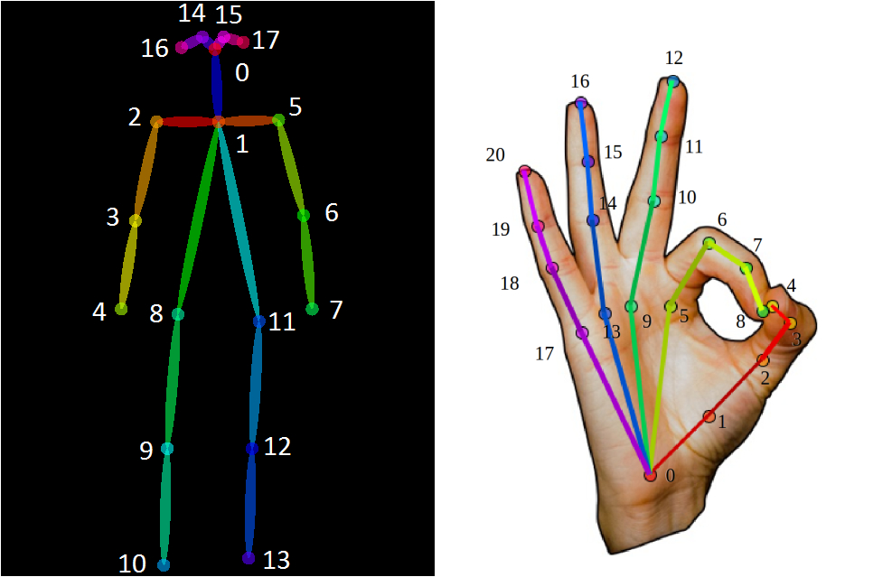
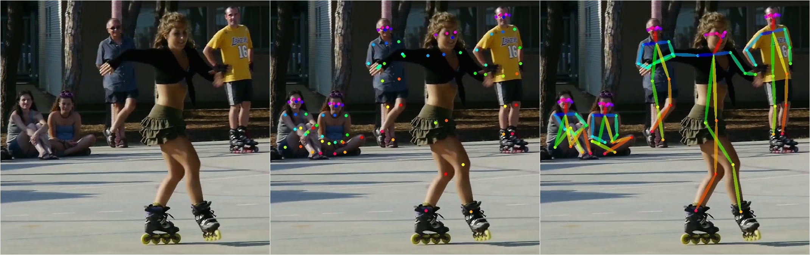
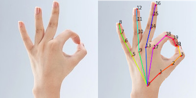
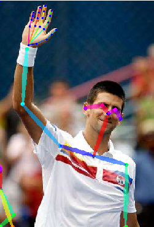

## pytorch-openpose

pytorch implementation of [openpose](https://github.com/CMU-Perceptual-Computing-Lab/openpose) including **Body and Hand Pose Estimation**, and the pytorch model is directly converted from [openpose](https://github.com/CMU-Perceptual-Computing-Lab/openpose) caffemodel by [caffemodel2pytorch](https://github.com/vadimkantorov/caffemodel2pytorch). You could implement face keypoint detection in the same way if you are interested in. Pay attention to that the face keypoint detector was trained using the procedure described in [Simon et al. 2017] for hands.

openpose detects hand by the result of body pose estimation, please refer to the code of [handDetector.cpp](https://github.com/CMU-Perceptual-Computing-Lab/openpose/blob/master/src/openpose/hand/handDetector.cpp).
In the paper, it states as:
```
This is an important detail: to use the keypoint detector in any practical situation, 
we need a way to generate this bounding box. 
We directly use the body pose estimation models from [29] and [4], 
and use the wrist and elbow position to approximate the hand location, 
assuming the hand extends 0.15 times the length of the forearm in the same direction.
```

If anybody wants a pure python wrapper, please refer to my [pytorch implementation](https://github.com/Hzzone/pytorch-openpose) of openpose, maybe it helps you to implement a standalone hand keypoint detector.

Don't be mean to star this repo if it helps your research.

### Getting Started

#### Install Requriements

Create a python 3.7 environement, eg:

    conda create -n pytorch-openpose python=3.7
    conda activate pytorch-openpose

Install pytorch by following the quick start guide here (use pip) https://download.pytorch.org/whl/torch_stable.html

Install other requirements with pip

    pip install -r requirements.txt

#### Download the Models

* [dropbox](https://www.dropbox.com/sh/7xbup2qsn7vvjxo/AABWFksdlgOMXR_r5v3RwKRYa?dl=0)
* [baiduyun](https://pan.baidu.com/s/1IlkvuSi0ocNckwbnUe7j-g)
* [google drive](https://drive.google.com/drive/folders/1JsvI4M4ZTg98fmnCZLFM-3TeovnCRElG?usp=sharing)

`*.pth` files are pytorch model, you could also download caffemodel file if you want to use caffe as backend.

Download the pytorch models and put them in a directory named `model` in the project root directory

#### Run the Demo

Run:

    python demo_camera.py

to run a demo with a feed from your webcam or run

    python demo.py

to use a image from the images folder or run 

    python demo_video.py <video-file>

to process a video file (requires [ffmpeg-python][ffmpeg]).

[ffmpeg]: https://pypi.org/project/ffmpeg-python/

### Todo list
- [x] convert caffemodel to pytorch.
- [x] Body Pose Estimation.
- [x] Hand Pose Estimation.
- [ ] Performance test.
- [ ] Speed up.

### Demo
#### Skeleton


#### Body Pose Estimation



#### Hand Pose Estimation


#### Body + Hand


#### Video Body


Attribution: [this video](https://www.youtube.com/watch?v=kc-e129SBb4).

#### Video Hand


Attribution: [this video](https://www.youtube.com/watch?v=yOAmYSW3WyU).

### Citation
Please cite these papers in your publications if it helps your research (the face keypoint detector was trained using the procedure described in [Simon et al. 2017] for hands):

```
@inproceedings{cao2017realtime,
  author = {Zhe Cao and Tomas Simon and Shih-En Wei and Yaser Sheikh},
  booktitle = {CVPR},
  title = {Realtime Multi-Person 2D Pose Estimation using Part Affinity Fields},
  year = {2017}
}

@inproceedings{simon2017hand,
  author = {Tomas Simon and Hanbyul Joo and Iain Matthews and Yaser Sheikh},
  booktitle = {CVPR},
  title = {Hand Keypoint Detection in Single Images using Multiview Bootstrapping},
  year = {2017}
}

@inproceedings{wei2016cpm,
  author = {Shih-En Wei and Varun Ramakrishna and Takeo Kanade and Yaser Sheikh},
  booktitle = {CVPR},
  title = {Convolutional pose machines},
  year = {2016}
}
```
